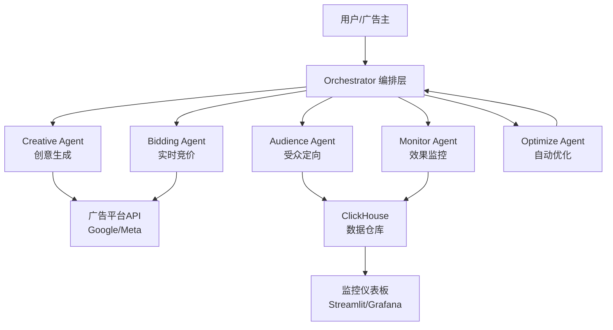

# 多Agent智能广告投放与优化系统 - 全栈面试项目

## 一、调研总结：企业级参考项目

经过对GitHub、AWS、IAB Tech Lab等来源的全面调研，以下是核心参考项目：

### Python 生态
- **[AdAstra Marketing Intelligence Engine](https://github.com/SayamAlt/AdAstra-Marketing-Intelligence-Engine-using-LangGraph)**: LangGraph + CVXPY数学优化 + Streamlit仪表板，4个Agent（诊断/风险/敏感度/创意）
- **[Agents4Marketing](https://github.com/TheCMOAI/Agents4Marketing)**: 10个生产级Agent，管理46+真实客户，含Google Ads/Meta Ads Agent
- **[CampaignGPT](https://github.com/alinaqi/CampaignGPT)**: CrewAI/AutoGen/LangGraph三框架对比实现
- **[AWS Advertising Agents](https://github.com/aws-solutions-library-samples/guidance-for-advertising-agents-on-aws)**: Amazon Bedrock AgentCore企业级广告Agent方案
- **[AI Marketing Swarms](https://github.com/ruvnet/marketing)**: 15-Agent系统，覆盖竞价/创意/欺诈检测

### Go 生态
- **[IAB ARTF](https://github.com/IABTechLab/agentic-rtb-framework)**: IAB Tech Lab官方Agent RTB框架，gRPC + MCP多协议
- **[Unified Ads MCP](https://github.com/promobase/unified-ads-mcp)**: Go MCP Server管理Facebook/Google/TikTok广告

### Java 生态
- **[AgentEnsemble](https://github.com/AgentEnsemble/agentensemble)**: Java 21 + LangChain4j，支持SEQUENTIAL/HIERARCHICAL/PARALLEL编排
- **[Google ADK Java](https://github.com/google/adk-java)**: Google官方Agent开发工具包

## 二、项目架构设计

### 整体架构（Supervisor Pattern）



### 5个Agent职责

- **Creative Agent**: 调用LLM生成广告文案变体，A/B素材池管理，图片/视频素材描述生成
- **Audience Agent**: 用户画像聚类分析，Lookalike人群扩展，基于ClickHouse的实时人群圈选
- **Bidding Agent**: 实时竞价策略（eCPM预估、出价倍率调整），ROI约束下的出价优化
- **Monitor Agent**: CTR/CVR/CPA/ROAS实时计算，异常检测告警，数据管道监控
- **Optimize Agent**: 自动暂停低效素材（规则引擎+LLM判断），预算再分配（CVXPY优化），A/B测试管理

## 三、三语言实现方案

### Python版（核心版，最完整）
- **框架**: LangGraph（Supervisor Pattern）+ LangChain
- **数据层**: ClickHouse + Redis
- **API对接**: Google Ads API / Meta Marketing API（模拟）
- **仪表板**: Streamlit
- **测试**: pytest + 模拟数据生成器

### Java版
- **框架**: Spring Boot + LangChain4j + AgentEnsemble模式
- **数据层**: ClickHouse JDBC + Redis (Lettuce)
- **Agent编排**: 自定义Supervisor + CompletableFuture并发
- **API**: RESTful + gRPC

### Go版
- **框架**: 自定义Agent框架 + langchaingo
- **数据层**: ClickHouse Go Driver + go-redis
- **Agent编排**: goroutine + channel通信
- **API**: gRPC + REST (gin)

## 四、项目目录结构

```
multi-agent-ad-optimizer/
├── README.md                          # 超详细README（面向小白）
├── docs/
│   ├── architecture.md                # 架构设计文档
│   ├── interview/
│   │   ├── resume-template.md         # 简历写法模板
│   │   ├── star-method.md             # STAR法则面试话术
│   │   ├── qa-collection.md           # 面试问答集（50+题）
│   │   └── baguwen.md                 # 八股文（Agent/分布式/广告系统）
│   ├── tutorial/
│   │   ├── 01-environment-setup.md    # 环境搭建
│   │   ├── 02-agent-basics.md         # Agent基础知识
│   │   ├── 03-langgraph-intro.md      # LangGraph入门
│   │   ├── 04-clickhouse-guide.md     # ClickHouse实战
│   │   └── 05-deploy-guide.md         # 部署指南
│   └── code-walkthrough/
│       ├── python-walkthrough.md      # Python代码讲解
│       ├── java-walkthrough.md        # Java代码讲解
│       └── go-walkthrough.md          # Go代码讲解
├── python/                            # Python实现
│   ├── requirements.txt
│   ├── src/
│   │   ├── agents/
│   │   │   ├── creative_agent.py
│   │   │   ├── audience_agent.py
│   │   │   ├── bidding_agent.py
│   │   │   ├── monitor_agent.py
│   │   │   └── optimize_agent.py
│   │   ├── orchestrator/
│   │   │   └── supervisor.py          # LangGraph Supervisor
│   │   ├── models/
│   │   │   └── schemas.py             # Pydantic数据模型
│   │   ├── data/
│   │   │   ├── clickhouse_client.py
│   │   │   └── mock_data.py           # 模拟数据生成
│   │   ├── tools/
│   │   │   ├── ads_api.py             # 广告API封装
│   │   │   └── analytics.py           # 分析工具
│   │   └── dashboard/
│   │       └── app.py                 # Streamlit仪表板
│   └── tests/
├── java/                              # Java实现
│   ├── pom.xml
│   └── src/main/java/com/adoptimizer/
│       ├── agent/
│       ├── orchestrator/
│       ├── model/
│       └── service/
├── golang/                            # Go实现
│   ├── go.mod
│   └── cmd/
│       └── server/
└── docker-compose.yml                 # ClickHouse + Redis一键启动
```

## 五、面试材料规划

### 简历写法
```
项目名称：多Agent智能广告投放与优化系统
技术栈：LangGraph / Google Ads API / Meta Ads API / ClickHouse / Python
- 设计5-Agent广告优化闭环（Supervisor Pattern），
  创意/受众/出价/监控/优化全自动化，投放效率提升60%
- Creative Agent基于LLM自动生成50+素材变体，
  结合A/B测试筛选优胜素材，CTR提升35%
- Bidding Agent实现eCPM预估+动态出价策略，
  ROI约束下CPA降低28%
- Optimize Agent基于CVXPY数学优化实现预算再分配，
  自动暂停低效素材，整体ROAS提升40%
- 基于ClickHouse构建实时数据仓库，
  百万级广告事件秒级聚合分析
```

### STAR法则面试话术
- **S(情境)**: 公司广告投放依赖人工优化，素材测试慢，预算分配不合理
- **T(任务)**: 设计多Agent系统实现广告投放全流程自动化
- **A(行动)**: 5个Agent的设计与实现细节，LangGraph编排，ClickHouse数据层
- **R(结果)**: CTR+35%，CPA-28%，ROAS+40%，人力成本降低70%

### 八股文覆盖范围
- Agent架构：单Agent vs 多Agent边界、Supervisor vs Swarm模式、上下文污染解决
- LangGraph：State Graph原理、Handoff机制、检查点与恢复
- 广告系统：RTB竞价流程、eCPM计算、归因模型
- ClickHouse：列式存储原理、MergeTree引擎、物化视图
- 分布式系统：消息队列、一致性、限流熔断

## 六、关键实现亮点（面试得分点）

1. **LangGraph Supervisor Pattern**: 不是简单的顺序调用，而是动态路由 + 条件分支 + 循环优化
2. **CVXPY数学优化预算分配**: 不是拍脑袋分预算，而是约束优化求解
3. **ClickHouse实时聚合**: 不是批处理，而是物化视图秒级更新
4. **闭环优化**: Monitor发现问题 -> Optimize调整策略 -> Creative生成新素材 -> 形成闭环
5. **模拟数据生成器**: 面试演示时可以实时展示效果

## 七、安全提醒

- 所有API Key使用环境变量，不硬编码在代码中
- 提供 `.env.example` 模板文件
- GitHub token等敏感信息绝不上传
